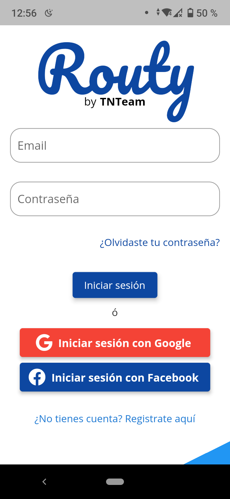
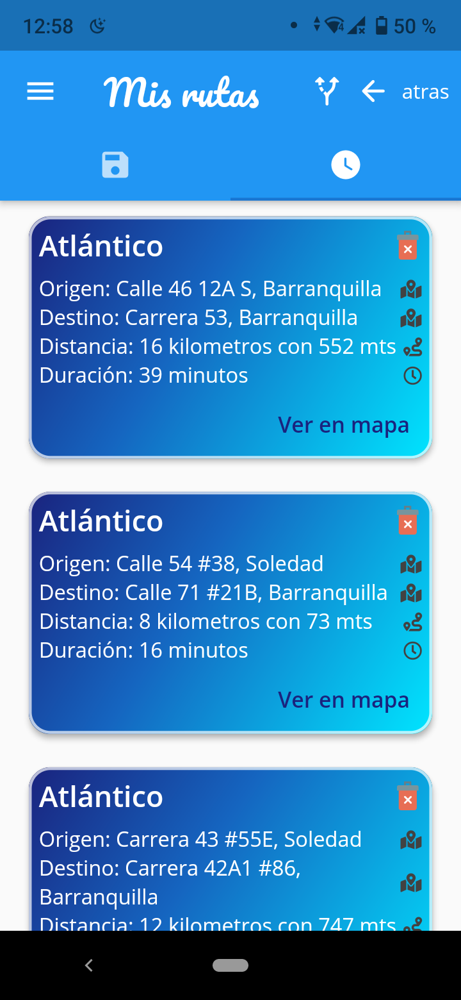
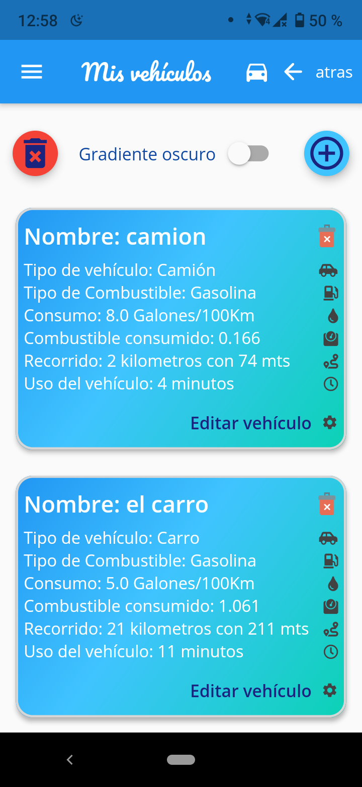
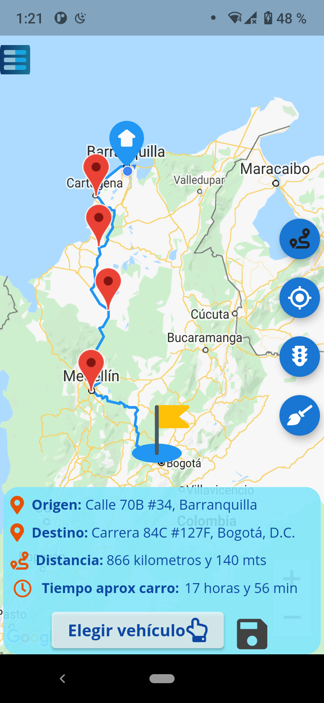
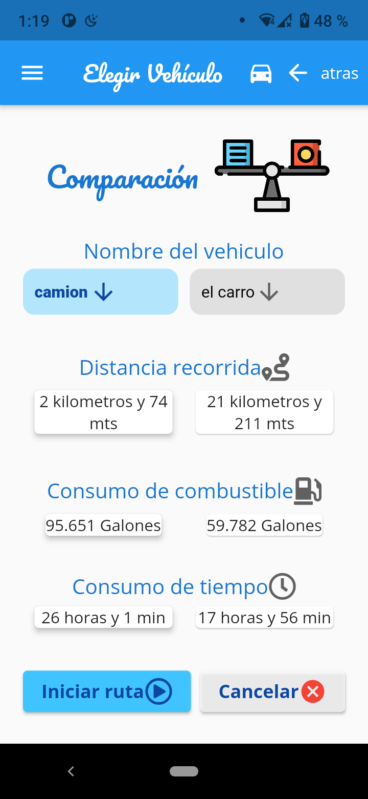
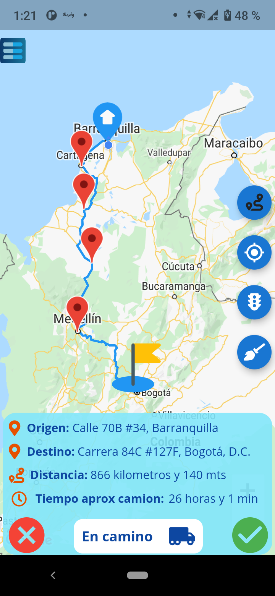
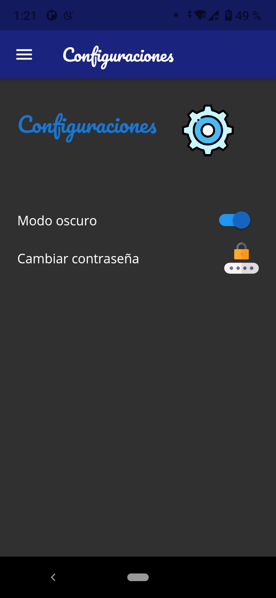
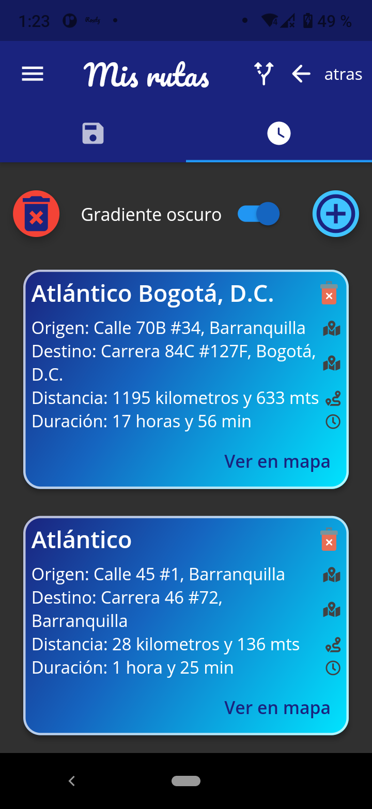
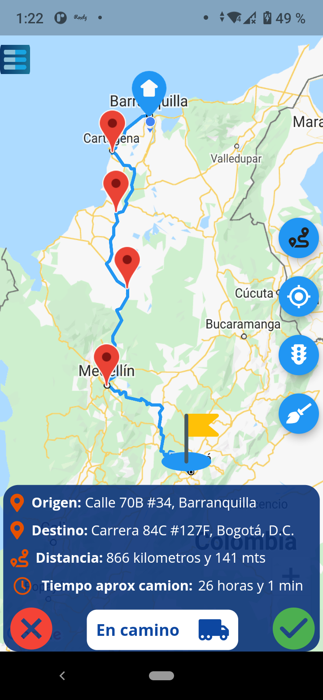

# routy_app

Esta es una App de flutter que hasta el momento hace uso de las siguientes cosas:
* Autenticación con firebase
* Base de datos con firestore
* Inicio de sesión con google, facebook y correo y contraseña
* Mapa de google
* GetX, aprovechamos su funcionalidad de singleton y llamar instancias para hacer injección de dependencias
* BackgroundLocation para obtener datos de gps aun con la app en segundo plano (Solo se utiliza mientras se esta en una ruta)
* GetStorage para guardar si se está o no en modo oscuro.
* Api Reverse Geocoding de Here Maps, hasta ahora para utilizar el Reverse Geocoding (https://developer.here.com/documentation/geocoding-search-api/api-reference-swagger.html)
* Matrix api de Openrouteservice, para obtener una matrix de distancia entre puntos. (https://openrouteservice.org/dev/#/api-docs/v2/matrix)
* Api TSP-Routy, la hice yo mismo en Flask. Recibe una matriz de distancia y devuelve el camino minimo. (https://github.com/lkavila/tsp-routy)   
* Api de direcciones de Openrouteservice, para obtener los polylines entre puntos, es decir, para dibujar una ruta que englobe todos los puntos en el mapa. (https://openrouteservice.org/dev/#/api-docs/directions)

## Link para ver diseño en figma
https://www.figma.com/file/CclKZWq7vYQrzL9OPPDomg/Routy?node-id=0%3A1

## Flutter App Screenshots

<table>
  <tr>
    <td>Inicio-Login</td>
     <td>Lista de rutas en modo light</td>
     <td>Lista de vehículos en modo light</td>
  </tr>
  <tr>
    <td></td>
    <td></td>
    <td></td>
  </tr>
 </table>

 <table>
  <tr>
    <td>Viendo mapa - escoger ruta y vehículo</td>
     <td>Elegir vehículo</td>
     <td>En camino</td>
  </tr>
  <tr>
    <td></td>
    <td></td>
    <td></td>
  </tr>
 </table>

 <table>
  <tr>
    <td>Poner en modo oscuro</td>
     <td>Lista de rutas en modo oscuro</td>
     <td>Ruta en el mapa en modo oscuro</td>
  </tr>
  <tr>
    <td></td>
    <td></td>
    <td></td>
  </tr>
 </table>
